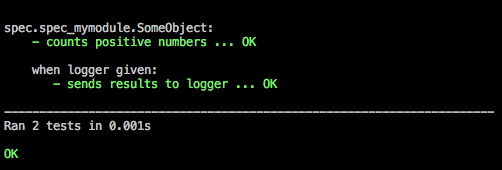
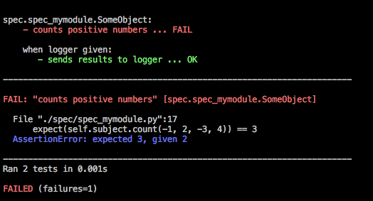

flowp.testing
--------------
Module is written on top of builtin unittest module in a very minimalistic way
with minimum of magic. It provides 4 features of BDD style testing:

* specifications (style for test cases)
* expectations (style for asserts)
* behavior contexts
* specification oriented test runner

In the end it's all about bringing testing style, testing good practices.

Quick start
^^^^^^^^^^^^
Test subject (mymodule.py):

.. code-block:: python

    class SomeObject:
        def __init__(self, logger=None):
            self._logger = logger

        def count(self, *args):
            positives = 0
            for arg in args:
                if arg > 0:
                    positives += 1

            if self._logger:
                self._logger.info(positives)
            else:
                return positives

Behavior specification (spec_mymodule.py):

..  code-block:: python

    import mymodule
    from flowp.testing import Behavior, when, expect
    from unittest import mock

    class SomeObject(Behavior):
        def before_each(self):
            self.subject = mymodule.SomeObject()

        def logger_given(self):
            self.logger = mock.Mock()
            self.subject = mymodule.SomeObject(self.logger)

        def it_counts_positive_numbers(self):
            expect(self.subject.count(-1, 2, -3, 4)) == 2

        @when(logger_given)
        def it_sends_results_to_logger(self):
            self.subject.count(-1, 2, -3, 4)
            expect(self.logger.info).called_with(2)

::

    $ python3 -m flowp.testing -v

Specifications
^^^^^^^^^^^^^
Replacement for test cases. Specifications are the way how we want to
describe objects which we want to create, we specify, describe their
behaviors.
That's why test case should have more descriptive character and each
test method should describe behavior of the object which we want to test.

This have some consequences in the test case construct:

* each test method should start with it_*
* name of test module should start with spec_*
* test case class should inherit from 'Behavior' class
* setUp / tearDown methods are now before_each / after_each methods

.. code-block:: python

    from flowp.testing import Behavior

    class TermLogger(Behavior):
        def it_log_error_with_red_color(self):
            ...

        def it_log_info_with_white_color(self):
            ...

.. note::

    For now there is no before_all / after_all methods but it is planned
    to add them.

Expectations
^^^^^^^^^^^^^^
Expectations are replacement of asserts. They provide better feedback than asserts
similar to self.assert* methods, but they are shorter and easier to remember.
Example of expectation::

    expect(subject) == expected_value

There are many type of expectations.

Basic expectations
""""""""""""""""""""

=============================== ===============================
expectation                     corresponding assert
=============================== ===============================
expect(a).ok                    assert a
expect(a).not_ok                assert not a
expect(a) == b                  assert a == b
expect(a) != b                  assert a != b
expect(a) < b                   assert a < b
expect(a) > b                   assert a > b
expect(a) >= b                  assert a >= b
expect(a) <= b                  assert a <= b
expect(a).isinstance(b)         assert isinstance(a, b)
expect(a).not_isinstance(b)     assert not isinstance(a, b)
expect(a).be_in(b)              assert a in b
expect(a).not_be_in(b)          assert a not in b
expect(a).be(b)                 assert a is b
expect(a).not_be(b)             assert a is not b
=============================== ===============================

Exception expectation
"""""""""""""""""""""""

.. code-block:: python

    with expect.to_raise(AssertionError):
        assert 1 == 2

Mock expectations
""""""""""""""""""""
link to mocking...

Custom expectations
""""""""""""""""""""

You can also create Your own expectations. 'expect' is a normal class
(but with lowercased name), which implements methods such a '__eq__' or
'ok', so You can write Your own expect class which will inherit from
the original one.

.. code-block:: python

    from flowp import testing

    class expect(testing.expect):
        def is_equal_to(self, expectation):
            assert self._context == expectation,\
                "expected %s, given %s" % (expectation, self._context)

::

    expect(2).is_equal_to(2)

Behavior contexts
^^^^^^^^^^^^^^
It is possible to give contexts for specific behaviors by @when decorator.
Decorator can take as an argument generator or string. When it receive generator
it will treat it as a context manager, string will be only used for test runner
results.

.. code-block:: python

    class User(Behavior):
        def logged_as_admin(self):
            # do some before actions
            yield
            # do some after actions

        @when(logged_as_admin):
        def it_can_delete_posts(self):
            pass

        @when(logged_as_admin):
        def it_can_add_new_users(self):
            pass

        @when('executing login'):
        def it_rejects_not_registered(self):
            pass

'yield' statement define the border between setup/teardown actions,
like in contextlib.contextmanager module but for tests. Context method
can be also used without yield statement and then it will behave like an
only setup context.

We can also use many contexts together:

.. code-block:: python

    class User(Behavior):
        def executing_login(self):
            ...

        def user_not_registered(self):
            ...

        def user_registered(self):
            ...

        @when(executing_login, user_not_registered)
        def it_interrupts_process(self):
            ...

        @when(executing_login, user_registered)
        def it_pass_process(self):
            ...

Unfortunately test methods with identical names will collide even if they
have different contexts in when decorator. For now there is no solution for
this, they just need different names.

Specifications runner
^^^^^^^^^^^^^
Flowp add some additional features to standard unittest test runner:

* coloring
* descriptive character results
* results context oriented (cooperation with @when)
* reformatted fails feedback (more minimalistic with colors)
* 2 new script options (-a --auto and --nocolors)

Specifications runner fired with option --auto (-a)::

    python3 -m flowp.testing --auto

will be automatically rerunning specs, after each 4 seconds.

Mocking
^^^^^^^^^^^^^^^
Very simple mocking:

* self.mock is a mocks factory
* it returns MagicMock each time as default
* it can be used as patcher if first argument given
  (mock factory holds reference and it will unpatch mock after each test)
* have type arg (type='magicmock')
* work as patch.object: self.mock(object, 'attr_name')

.. code-block:: python

    class MyObject(Behavior):
        def before_each(self):
            self.mocked_logger = self.mock('logger')

        def it_do_some_stuff(self):
            ...

Mock expectations
""""""""""""""""""""
::

    from unittest import mock
    m = mock.Mock()

=============================== ===============================
expectation                     corresponding assert
=============================== ===============================
expect(m).called                assert m.called
expect(m).not_called            assert not m.called
expect(m).called_with(...)      m.assert_any_cal(...)
=============================== ===============================

Files testing
^^^^^^^^^^^^^^^
Example:

.. code-block:: python

    from flowp.testing import FileSystemBehavior, expect
    from flowp.system import touch, exist

    class Touch(FileSystemBehavior):
        def before_each(self):
            super().before_each()
            # do some preparations

        def it_create_file(self):
            touch('testfile')
            expect(exist('testfile')).ok

.. autoclass:: flowp.testing.FileSystemBehavior
    :members: before_each, after_each, reset_cwd
